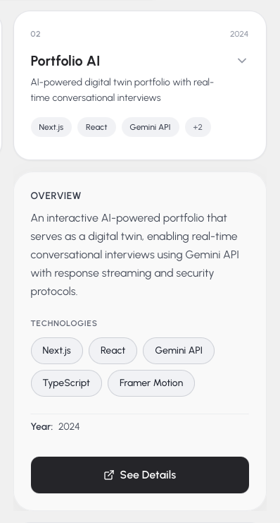

# Portfolio AI

Personal site for Minwook Shin, built as a small AI-native portfolio system.

It combines case studies, interaction studies, an AI guide, markdown routes, and a lightweight design-system surface.

[Live site](https://www.minwookshin.com) · [Case study](https://www.minwookshin.com/work/portfolio-ai)



## Overview

- Portfolio home for work, studies, contact, and guided browsing.
- Case-study archive with project detail pages.
- Streaming Gemini endpoint for asking questions about the work.
- Markdown/text routes: `/portfolio.md`, `/llms.txt`.
- Design-system routes: `/design-system`, `/design-system.md`, `/design-system/tokens.json`.
- Local video pipeline for project hover previews.

## Stack

- Next.js App Router
- React and TypeScript
- Tailwind CSS with CSS variable tokens
- Framer Motion
- Gemini API
- Vitest and ESLint

## Develop

```bash
npm install
npm run dev
```

Open `http://localhost:3000`.

## Scripts

| Command | Description |
| --- | --- |
| `npm run lint` | Run ESLint |
| `npm run typecheck` | Check TypeScript |
| `npm test` | Run Vitest |
| `npm run build` | Build the production app |
| `npm run render:hover-previews` | Render project hover videos |

## Environment

The AI route reads a Gemini key from local or deployment env:

```bash
GEMINI_API_KEY=...
GEMINI_MODEL=gemini-2.5-flash-lite
```

`GEMINI_MODEL` is optional.

## Notes

Generated preview videos live in `public/projects/previews/`. The render manifest lives in `scripts/hover-preview-manifest.mjs`.
